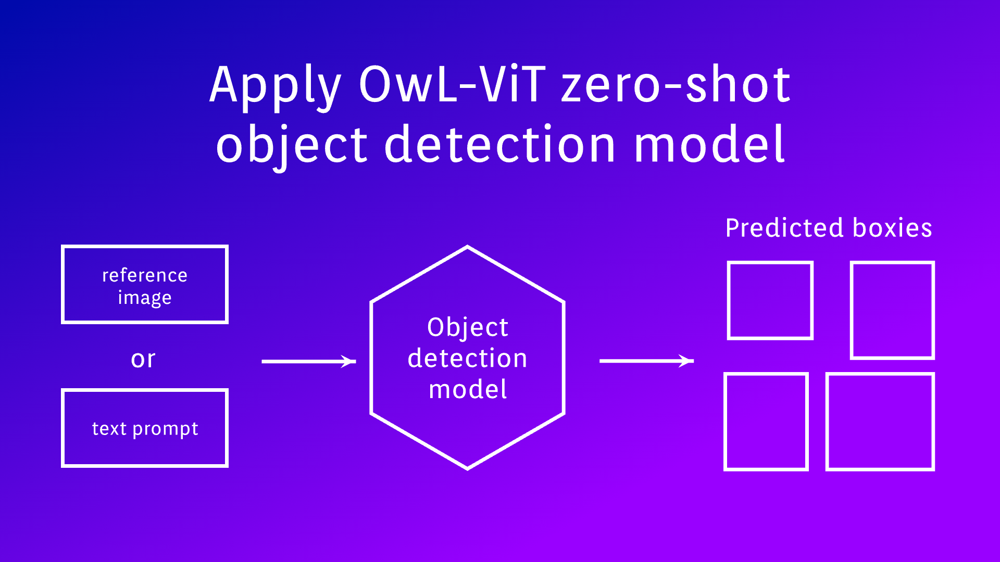

# Owl-ViT-app
Integration of the Owl-ViT model for class-agnostic object detection

  <a href="#Overview">Overview</a> •
  <a href="#How-to-Use">How to use</a> •
  <a href="#Demo">Demo</a>

# Overview
Application allows you to label projects images using Owl-ViT detection model.

Application key points:

- Select project to label
- Choose the model configuration for local run or run via [serve owl-vit app](https://github.com/supervisely-ecosystem/serve-owl-vit) 
- Set up model input data as text-prompt or reference-image
- Preview detection results
- Apply model to project images and save new annotations to new project or add to existed  

# Results screenshoot

Reference-image

Text-prompt

